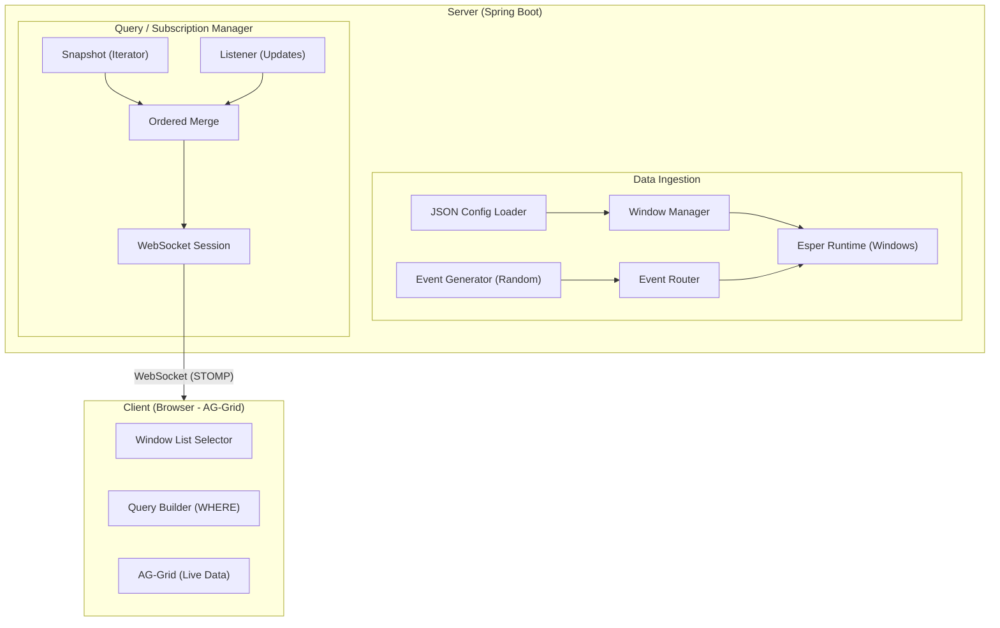

# Esper 8.7.0 Real-Time Event Window Application

## Overview

A Java client-server application built on Esper 8.7.0 CEP engine that allows dynamic creation of named windows from JSON configuration, real-time event streaming via WebSocket, and a browser-based client using AG-Grid for querying and viewing window data.

## Architecture



## Server

### 1. Window Configuration (JSON)

Windows are defined in JSON files placed in a `config/windows/` directory. Each file defines one window.

**Example: `config/windows/orders.json`**
```json
{
  "name": "Orders",
  "primaryKeys": ["orderId"],
  "columns": [
    { "name": "orderId",    "type": "string" },
    { "name": "symbol",     "type": "string" },
    { "name": "side",       "type": "string" },
    { "name": "quantity",   "type": "int" },
    { "name": "price",      "type": "double" },
    { "name": "status",     "type": "string" },
    { "name": "timestamp",  "type": "long" }
  ]
}
```

**Supported data types:** `string`, `int`, `long`, `double`, `float`, `boolean`

### 2. Esper Runtime Setup

For each window config:
1. Register an event type (schema) with Esper using the column definitions.
2. Create a named window: `create window <Name>.win:keepall() as <EventType>`
3. Create insert-into: `insert into <Name> select * from <Name>Event`
4. Create on-merge (upsert): `on <Name>UpsertEvent as ue merge <Name> as w where <PK match> when matched then update set ... when not matched then insert select ...`
5. Create on-delete: `on <Name>DeleteEvent as de delete from <Name> as w where <PK match>`

### 3. Event Generator

- REST API and Web UI to trigger random event generation per window.
- Generates events with random values appropriate to each column's data type.
- Supports: generate N events, start/stop continuous generation at configurable rate.
- Events are sent as JSON to the Esper runtime via the appropriate event type.

### 4. Query / Subscription Manager (Critical Edge Case Handling)

When a client subscribes to a window with optional WHERE criteria:

**The Problem:** If we first iterate the snapshot and then attach a listener, we may miss events that arrive between the snapshot and listener attachment. If we attach the listener first and then iterate, we may send duplicates or out-of-order messages (e.g., a delete for a row the client hasn't seen yet).

**The Solution — Ordered Merge with Sequence Numbers:**

1. **Acquire the window lock** (Esper's named window lock or a dedicated ReentrantLock per window).
2. **Attach the update listener** on the named window's statement. Buffer incoming events into a queue.
3. **Begin snapshot iteration** using `safeIterator()` on the named window.
4. **Release the lock** — at this point, the listener will capture all events from this moment forward.
5. **Stream the snapshot** to the client. Each message is tagged `type: "snapshot"` with a sequence number.
6. **Send a `snapshot_complete` marker** to the client.
7. **Drain the buffered listener queue** and stream those events, tagged `type: "update"` (insert/update/delete) with sequence numbers.
8. **Switch to live mode** — listener events are sent directly to the client's WebSocket session.

**Sequence numbers** ensure the client can detect gaps and request retransmission if needed.

**Message format:**
```json
{
  "seq": 1,
  "type": "snapshot | insert | update | delete | snapshot_complete",
  "windowName": "Orders",
  "data": { "orderId": "O1", "symbol": "AAPL", ... }
}
```

### 5. REST API

| Method | Path | Description |
|--------|------|-------------|
| GET | `/api/windows` | List all configured windows with schemas |
| GET | `/api/windows/{name}` | Get window schema |
| POST | `/api/generate/{name}` | Generate N random events `{ "count": 100 }` |
| POST | `/api/generate/{name}/start` | Start continuous generation `{ "ratePerSecond": 10 }` |
| POST | `/api/generate/{name}/stop` | Stop continuous generation |

### 6. WebSocket (STOMP over SockJS)

| Destination | Description |
|-------------|-------------|
| `/app/subscribe` | Subscribe to a window `{ "windowName": "Orders", "where": "price > 100" }` |
| `/app/unsubscribe` | Unsubscribe `{ "subscriptionId": "..." }` |
| `/user/queue/data` | Client receives streamed data |

## Client (Web UI)

### AG-Grid Live View
1. **Window selector** — dropdown listing all available windows (fetched from REST API).
2. **Query builder** — text input for Esper WHERE clause (e.g., `price > 100 and symbol = 'AAPL'`).
3. **Subscribe button** — connects via WebSocket, subscribes to the selected window.
4. **AG-Grid** — displays data with the following behavior:
   - On `snapshot` messages: add rows using grid transaction API.
   - On `snapshot_complete`: mark loading done.
   - On `insert`: add row via transaction API.
   - On `update`: update row via transaction API (matched by primary key).
   - On `delete`: remove row via transaction API (matched by primary key).
5. **Status bar** — shows connection state, event counts, last sequence number.

### Event Generator UI
- Per-window controls to generate random events or start/stop continuous generation.
- Shows generation status and event count.

## Technology Stack

| Component | Technology |
|-----------|-----------|
| CEP Engine | Esper 8.7.0 |
| Server Framework | Spring Boot 3.x |
| WebSocket | Spring WebSocket (STOMP + SockJS) |
| Build Tool | Maven |
| Client Grid | AG-Grid Community |
| Client Framework | Vanilla JS (single HTML page) |
| JSON Parsing | Jackson |

## Project Structure

```
esper-window-app/
├── pom.xml
├── config/
│   └── windows/
│       ├── orders.json
│       └── quotes.json
├── src/main/java/com/example/esper/
│   ├── EsperWindowApplication.java
│   ├── config/
│   │   ├── WebSocketConfig.java
│   │   └── EsperConfig.java
│   ├── model/
│   │   ├── WindowConfig.java
│   │   ├── ColumnDef.java
│   │   ├── SubscriptionRequest.java
│   │   └── DataMessage.java
│   ├── service/
│   │   ├── WindowManager.java
│   │   ├── EsperService.java
│   │   ├── SubscriptionManager.java
│   │   └── EventGenerator.java
│   └── controller/
│       ├── WindowController.java
│       └── WebSocketController.java
└── src/main/resources/
    ├── application.properties
    └── static/
        └── index.html
```
