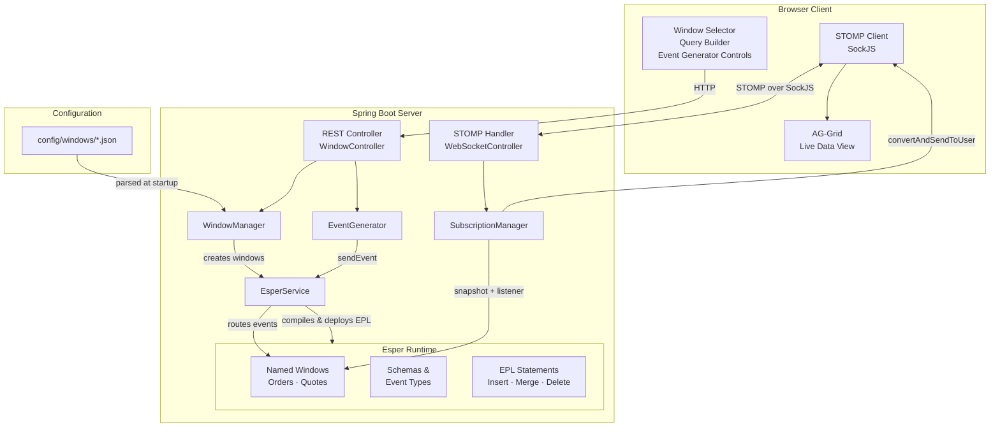
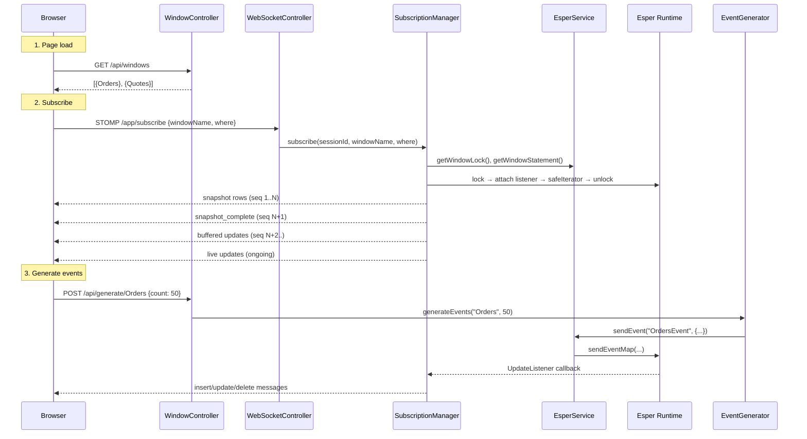
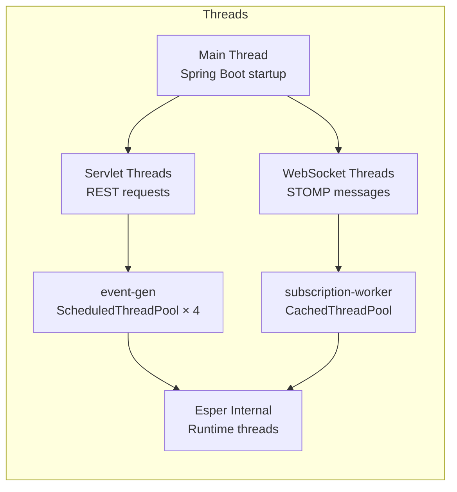

# Architecture

## High-Level Overview

The Esper Window Application is a real-time event processing system built on three pillars:

1. **Esper CEP 8.7.0** — the Complex Event Processing engine that manages named windows, event schemas, and continuous queries
2. **Spring Boot 3.2.5** — provides the web server, REST API, WebSocket (STOMP/SockJS) transport, and dependency injection
3. **AG-Grid (Browser)** — renders live-updating tabular data with row-level insert/update/delete animations

## Component Responsibilities

### Config Layer

| Class | Role |
|-------|------|
| `EsperConfig` | Creates the Esper `Configuration`, initializes the `EPRuntime`, and exposes a `compileAndDeploy()` helper that compiles EPL strings and deploys them into the running engine. |
| `WebSocketConfig` | Configures Spring's STOMP message broker with destinations `/topic`, `/queue`, application prefix `/app`, user prefix `/user`, and a SockJS endpoint at `/ws`. |

### Model Layer

| Class | Role |
|-------|------|
| `WindowConfig` | POJO mapping a JSON window definition — name, primary keys, column list. |
| `ColumnDef` | A single column's name and type string, with a `toJavaType()` helper. |
| `SubscriptionRequest` | Payload for the STOMP `/app/subscribe` message — window name + optional WHERE clause. |
| `DataMessage` | The envelope sent from server to client: sequence number, message type, window name, subscription ID, and data map. |

### Service Layer

| Class | Role |
|-------|------|
| `WindowManager` | Scans `config/windows/` at startup (`@PostConstruct`), deserializes JSON into `WindowConfig`, and delegates to `EsperService.createWindow()`. Maintains a registry of loaded configs. |
| `EsperService` | The bridge to Esper: generates EPL for schemas, named windows, insert-into, on-merge (upsert), and on-delete statements. Provides `sendEvent()`, `executeQuery()` (fire-and-forget), and `createFilteredStatement()` for subscriptions. Manages per-window `ReentrantLock` instances. |
| `SubscriptionManager` | Implements the [Snapshot-Streaming pattern](./SnapshotStreamingDesign.md): acquires lock → attaches listener → snapshots window → releases lock → streams snapshot → drains buffer → goes live. |
| `EventGenerator` | Produces random events appropriate to each column's type and name (e.g., stock symbols, prices, quantities). Supports batch and continuous (scheduled) generation with configurable rate. |

### Controller Layer

| Class | Role |
|-------|------|
| `WindowController` | REST endpoints: list windows, get window schema, generate events, start/stop continuous generation. |
| `WebSocketController` | STOMP message handlers: `/app/subscribe`, `/app/unsubscribe`, and `SessionDisconnectEvent` cleanup. |

## Data Flow

## Technology Stack

| Layer | Technology | Version |
|-------|-----------|---------|
| CEP Engine | Esper | 8.7.0 |
| Server Framework | Spring Boot | 3.2.5 |
| WebSocket | Spring WebSocket (STOMP + SockJS) | — |
| EPL Compiler | Esper Compiler + Janino 3.1.6 | — |
| Serialization | Jackson | (managed by Spring Boot) |
| Build | Maven | — |
| Java | JDK | 17+ |
| UI Grid | AG-Grid Community | 31.0.3 |
| UI Framework | Vanilla JavaScript | — |

## Threading Model

- **REST requests** are handled on Tomcat servlet threads.
- **STOMP messages** arrive on Spring WebSocket threads; subscription work is offloaded to a `CachedThreadPool` (`subscription-worker` threads).
- **Event generation** runs on a `ScheduledThreadPool` with 4 daemon threads.
- **Esper callbacks** (UpdateListener) fire on the thread that sent the event, meaning listener code in `SubscriptionManager` runs on event-gen or servlet threads.
- **Per-window `ReentrantLock`** serializes the critical snapshot+listener setup phase.
