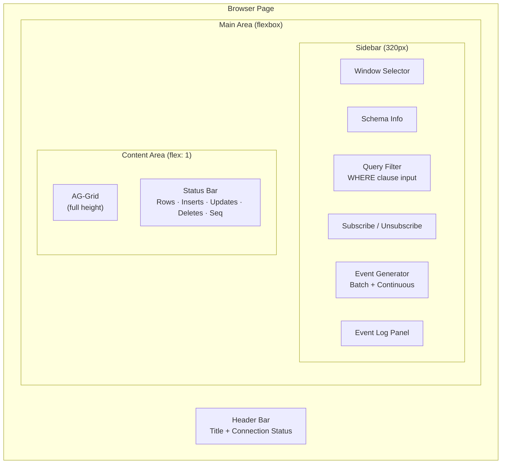
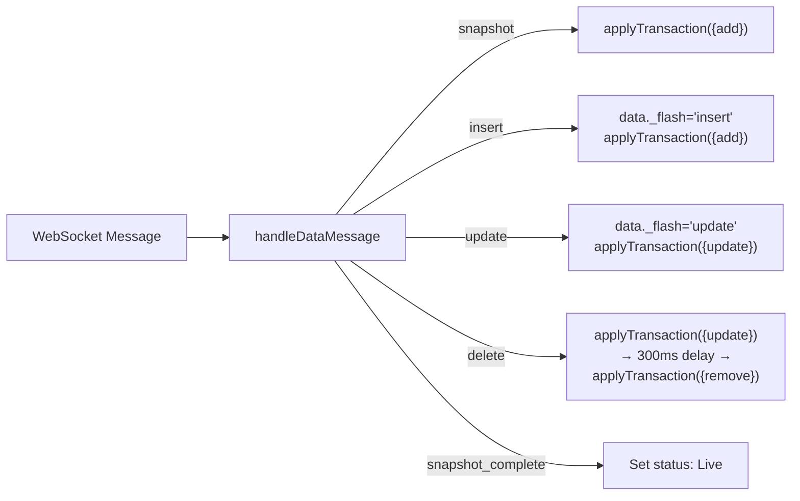

# Client UI Design

## Overview

The client is a **single-page application** served from `src/main/resources/static/index.html`. It uses vanilla JavaScript (no build step, no framework) with three external libraries loaded from CDN:

| Library | Version | Purpose |
|---------|---------|---------|
| SockJS Client | 1.x | WebSocket transport with fallback |
| STOMP.js | 2.3.3 | STOMP protocol over SockJS |
| AG-Grid Community | 31.0.3 | High-performance data grid |

## Layout



## UI Components

### Window Selector

On page load, the client fetches `GET /api/windows` and populates a `<select>` dropdown. Selecting a window:

1. Fetches the full schema from `GET /api/windows/{name}`
2. Stores `primaryKeys` and `columns` in local state
3. Displays the schema (column names, types, PK indicators) in a compact info panel
4. Initializes the AG-Grid with column definitions derived from the schema
5. Enables the Subscribe and Event Generator buttons

### Query Builder

A text input for an optional Esper WHERE clause. Examples:

- `price > 100`
- `symbol = 'AAPL' and side = 'BUY'`
- `quantity >= 1000`

The clause is passed directly to the server in the STOMP subscribe message.

### AG-Grid Configuration

```javascript
const gridOptions = {
    columnDefs: columnDefs,          // derived from WindowConfig.columns
    getRowId: params =>              // PK-based row identity
        primaryKeys.map(pk => params.data[pk]).join('|'),
    animateRows: true,
    rowSelection: 'single',
    getRowClass: params => {         // flash animation CSS classes
        if (params.data._flash) return 'flash-' + params.data._flash;
        return null;
    }
};
```

**Key design decisions:**

- `getRowId` uses the primary key(s) joined by `|` — this enables AG-Grid's transaction API to match rows for updates and deletes
- `animateRows` enables smooth row add/remove animations
- `_flash` is a transient property added to row data to trigger CSS flash animations, then removed after 600ms

### Data Flow into AG-Grid



### Row Flash Animations

CSS `@keyframes` animations provide visual feedback:

| Operation | Color | CSS Class |
|-----------|-------|-----------|
| Insert | Green fade | `flash-insert` — `rgba(39, 174, 96, 0.3)` → transparent |
| Update | Yellow fade | `flash-update` — `rgba(243, 156, 18, 0.3)` → transparent |
| Delete | Red fade | `flash-delete` — `rgba(192, 57, 43, 0.3)` → transparent |

Delete has a two-step animation: flash red (via `applyTransaction({ update })`) → wait 300ms → remove (via `applyTransaction({ remove })`).

### Event Generator Panel

Controls for injecting test data:

| Control | Description |
|---------|-------------|
| Batch Count | Number input (default 50) + "Generate Batch" button |
| Continuous Rate | Number input (events/sec, default 5) + Start/Stop buttons |

These call the REST API endpoints (`POST /api/generate/{name}`, etc.).

### Event Log

A scrolling monospace panel showing recent activity with color-coded entries:

| Type | Color |
|------|-------|
| Info | Default |
| Snapshot | Blue |
| Insert | Green |
| Update | Yellow |
| Delete | Red |

Limited to 200 entries (oldest removed first).

### Status Bar

A bottom bar showing real-time counters:

| Counter | Description |
|---------|-------------|
| Connection dot | Green (Live), Yellow (Loading), Red (Not subscribed) |
| Rows | Current row count in grid |
| Inserts | Total inserts received |
| Updates | Total updates received |
| Deletes | Total deletes received |
| Seq | Last sequence number received |

## State Management

All state is held in closure variables within an IIFE:

```javascript
let stompClient = null;         // STOMP connection
let gridApi = null;             // AG-Grid API
let currentWindow = null;       // selected WindowConfig
let currentSubscriptionId = null;
let primaryKeys = [];
let columns = [];
let stats = { inserts: 0, updates: 0, deletes: 0, rows: 0, seq: 0 };
```

## Styling

The UI uses a dark theme with a color palette:

| Element | Color |
|---------|-------|
| Background | `#1a1a2e` |
| Sidebar / Header | `#16213e` |
| Borders | `#0f3460` |
| Accent / Brand | `#e94560` (red-pink) |
| Success | `#27ae60` (green) |
| Warning | `#f39c12` (orange) |
| Danger | `#c0392b` (red) |

AG-Grid uses the `ag-theme-balham-dark` theme.
