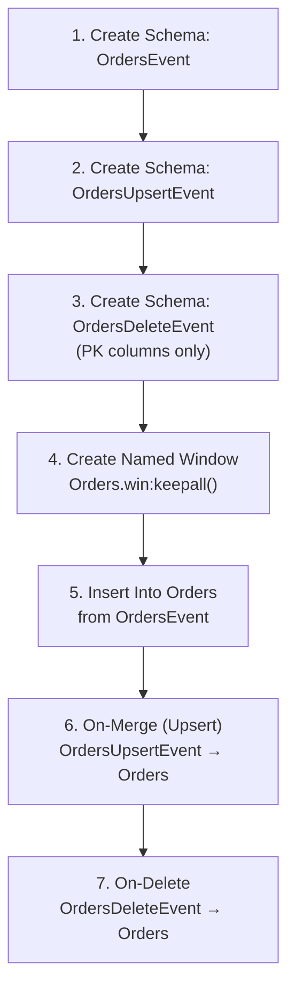
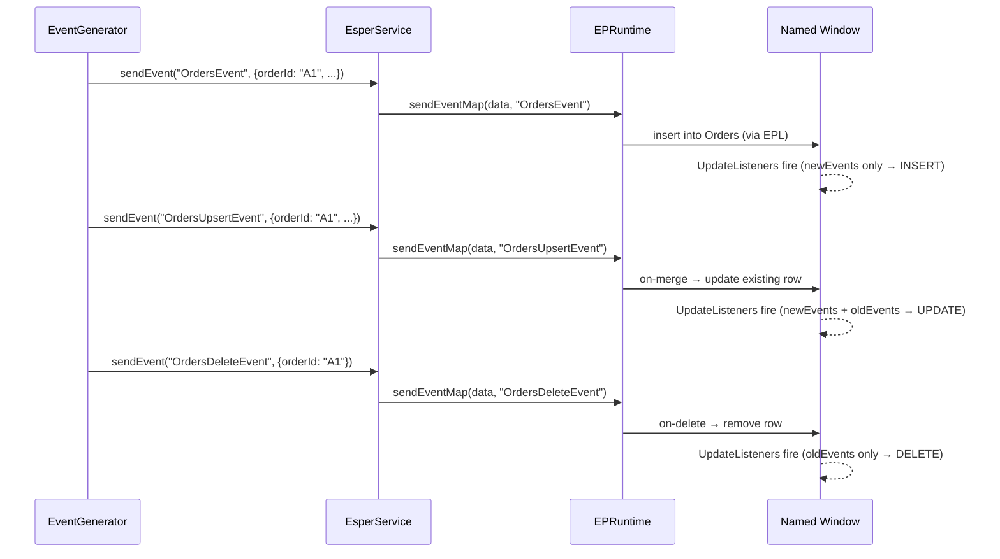

# Esper CEP Integration

## Overview

The application uses **Esper 8.7.0** as a Complex Event Processing engine. Esper provides:

- **Event type schemas** — column names and types registered at runtime
- **Named windows** (`win:keepall()`) — in-memory, keyed data stores
- **On-merge (upsert)** — atomic insert-or-update operations on named windows
- **On-delete** — row removal by primary key
- **Fire-and-forget queries** — ad-hoc SQL-like SELECT against window contents
- **Update listeners** — push-based notifications on window changes

## Runtime Initialization

`EsperConfig` creates a single `EPRuntime` instance at construction time:

```mermaid
graph LR
    EC[EsperConfig constructor] --> C[Configuration]
    C --> |addEventType DummyInit| RT[EPRuntime]
    RT --> |@Bean| Spring[Spring Context]
```

A `DummyInit` event type is registered so the runtime has at least one type at startup. This avoids an empty-configuration edge case in Esper.

The `compileAndDeploy(String epl)` method encapsulates the compile → deploy cycle:
1. Obtains the `EPCompiler`
2. Creates `CompilerArguments` with the current runtime configuration and runtime path (so new EPL can reference previously deployed schemas)
3. Compiles the EPL string
4. Deploys the compiled module into the running `EPRuntime`

## EPL Generation per Window

When `EsperService.createWindow(WindowConfig)` is called, it builds a **single EPL module** containing five statements for each window. Using the `Orders` window as an example:



### Generated EPL Example (Orders)

```sql
-- 1. Base event schema
@public @buseventtype create schema OrdersEvent(
    orderId string, symbol string, side string,
    quantity int, price double, status string, timestamp long
);

-- 2. Upsert event schema (same columns)
@public @buseventtype create schema OrdersUpsertEvent(
    orderId string, symbol string, side string,
    quantity int, price double, status string, timestamp long
);

-- 3. Delete event schema (PK columns only)
@public @buseventtype create schema OrdersDeleteEvent(orderId string);

-- 4. Named window (keepall = no expiry)
@name('Orders-window')
create window Orders.win:keepall() as OrdersEvent;

-- 5. Auto-insert from base event type
insert into Orders select * from OrdersEvent;

-- 6. Merge (upsert) on primary key match
on OrdersUpsertEvent as ue merge Orders as w
    where w.orderId = ue.orderId
    when matched then update set
        symbol = ue.symbol, side = ue.side, quantity = ue.quantity,
        price = ue.price, status = ue.status, timestamp = ue.timestamp
    when not matched then insert select
        ue.orderId as orderId, ue.symbol as symbol, ue.side as side,
        ue.quantity as quantity, ue.price as price, ue.status as status,
        ue.timestamp as timestamp;

-- 7. Delete on primary key match
on OrdersDeleteEvent as de delete from Orders as w
    where w.orderId = de.orderId;
```

### Why Three Event Types?

| Event Type | Purpose | Trigger |
|-----------|---------|---------|
| `OrdersEvent` | New inserts (simple append) | `sendEvent("OrdersEvent", data)` |
| `OrdersUpsertEvent` | Insert-or-update by PK | `sendEvent("OrdersUpsertEvent", data)` |
| `OrdersDeleteEvent` | Delete by PK | `sendEvent("OrdersDeleteEvent", pkData)` |

This separation allows the `EventGenerator` to choose the operation type explicitly.

## Event Routing



## Listener Semantics

Esper `UpdateListener` calls `update(newEvents, oldEvents, ...)`:

| `newEvents` | `oldEvents` | Meaning |
|-------------|-------------|---------|
| present | `null` | **INSERT** — new row added |
| present | present | **UPDATE** — row changed (`new` = current, `old` = previous) |
| `null` | present | **DELETE** — row removed |

The `SubscriptionManager` uses this pattern to determine the `type` field in outbound `DataMessage`.

## Fire-and-Forget Queries

`EsperService.executeQuery()` compiles a `SELECT * FROM <Window> [WHERE ...]` query on the fly, deploys it, iterates its results, and immediately undeploys it. This is used during the subscription snapshot phase when a WHERE clause is present, to get a filtered point-in-time view of the window.

## Per-Window Locking

A `ConcurrentHashMap<String, ReentrantLock>` in `EsperService` holds one lock per named window. This lock is used by `SubscriptionManager` to ensure that the snapshot and listener attachment happen atomically — see [Snapshot-Streaming Design](./SnapshotStreamingDesign.md) for details.

## Type Mapping

| JSON Type | Esper EPL Type | Java Class |
|-----------|---------------|------------|
| `string` | `string` | `String.class` |
| `int` / `integer` | `int` | `Integer.class` |
| `long` | `long` | `Long.class` |
| `double` | `double` | `Double.class` |
| `float` | `float` | `Float.class` |
| `boolean` | `boolean` | `Boolean.class` |
