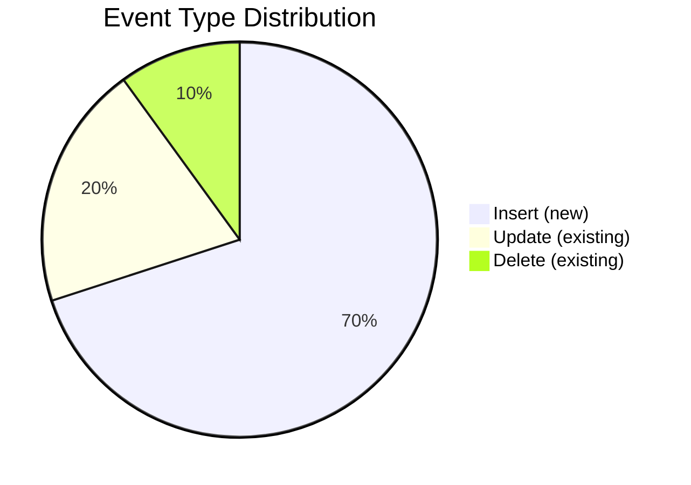
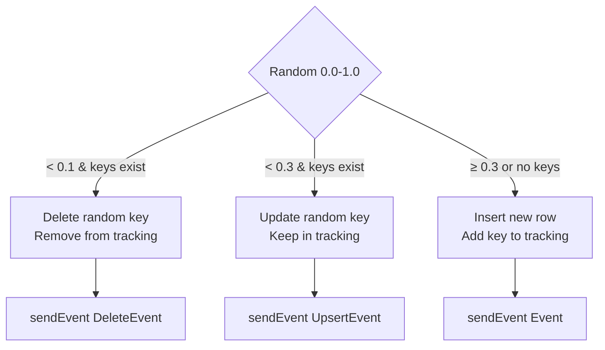
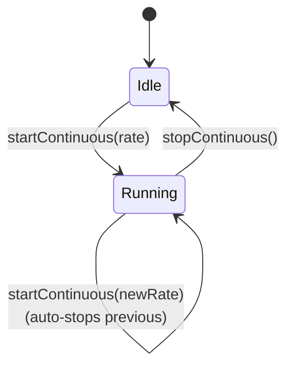

# Event Generator

## Purpose

The `EventGenerator` service produces random but realistic events for testing and demonstration. It supports two modes:

1. **Batch generation** — generate N events immediately
2. **Continuous generation** — generate events at a configurable rate (events/second) using a scheduled executor

## Event Type Distribution

Each generated event randomly selects one of three operations:



| Probability | Operation | Event Type | Description |
|-------------|-----------|-----------|-------------|
| 70% | Insert | `{Window}Event` | Creates a brand-new row with random PK |
| 20% | Update | `{Window}UpsertEvent` | Picks a random existing PK and sends updated values |
| 10% | Delete | `{Window}DeleteEvent` | Picks a random existing PK and removes it |

Updates and deletes fall back to inserts if no existing keys are available.

## Key Tracking

The generator maintains a `ConcurrentHashMap<String, List<Map<String, Object>>>` called `generatedKeys` that tracks the primary key values of all inserted rows per window. This allows it to:

- Pick a random existing key for updates
- Pick a random existing key for deletes (and remove it from the tracking list)



## Smart Value Generation

Values are generated based on column name heuristics, not just type:

### String Columns

| Column Name Contains | Values |
|---------------------|--------|
| `symbol` | `AAPL`, `GOOGL`, `MSFT`, `AMZN`, `TSLA`, `META`, `NVDA`, `JPM`, `BAC`, `WMT` |
| `side` | `BUY`, `SELL` |
| `status` | `NEW`, `PARTIAL`, `FILLED`, `CANCELLED` |
| `exchange` | `NYSE`, `NASDAQ`, `BATS`, `ARCA`, `IEX` |
| `id` or `order` | Random UUID prefix (8 chars) |
| other | `val-{random int}` |

### Numeric Columns

| Column Name Contains | Type | Range |
|---------------------|------|-------|
| `price`, `bid`, `ask` | double | 0.01 – 500.00 (2 decimal places) |
| `size`, `quantity`, `qty` | int | 1 – 9,999 |
| `timestamp` | long | `System.currentTimeMillis()` |
| other int | int | 1 – 999 |
| other double | double | 0.01 – 1,000.00 |
| other long | long | 1 – 999,999 |

### Boolean Columns

Random `true` / `false`.

## Scheduling

Continuous generation uses a `ScheduledExecutorService` with 4 daemon threads:

```java
ScheduledExecutorService scheduler = Executors.newScheduledThreadPool(4);
```

For a rate of N events/second, the period is `max(1, 1000/N)` milliseconds between events. This means:

| Requested Rate | Actual Period | Effective Max Rate |
|---------------|--------------|-------------------|
| 1/sec | 1000ms | 1/sec |
| 5/sec | 200ms | 5/sec |
| 10/sec | 100ms | 10/sec |
| 100/sec | 10ms | 100/sec |
| 1000/sec | 1ms | 1000/sec (theoretical) |

### Start / Stop



Calling `startContinuous()` when already running will stop the previous scheduled task before starting a new one.

## Thread Safety

- `generatedKeys` uses `ConcurrentHashMap` with `CopyOnWriteArrayList` for per-window key lists
- `runningGenerators` uses `ConcurrentHashMap` for tracking active `ScheduledFuture` instances
- All worker threads are daemon threads (won't prevent JVM shutdown)
