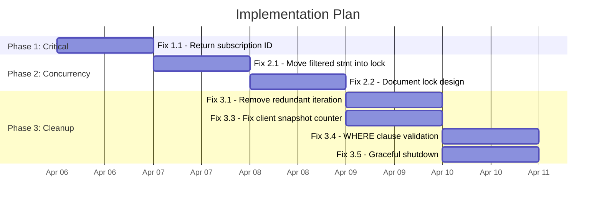

# Execution Plan

> Prioritized plan for resolving the issues identified in [Issues.md](./Issues.md).

## Phase 1: Critical Functional Fixes

These issues prevent core features from working correctly.

### Fix 1.1 — Return Subscription ID to Client

**Issue:** [#1 — Subscription ID not returned to client](#) + [#7 — Client doesn't extract subscription ID](#)

**Server change — `WebSocketController.java`:**

Send a confirmation message back to the client with the subscription ID immediately after `subscribe()` returns.

```java
@MessageMapping("/subscribe")
public void subscribe(SubscriptionRequest request, SimpMessageHeaderAccessor headerAccessor) {
    String sessionId = headerAccessor.getSessionId();
    String subscriptionId = subscriptionManager.subscribe(
            sessionId, request.getWindowName(), request.getWhere());

    // Send subscription confirmation with the ID
    DataMessage confirmation = new DataMessage(
        0, "subscribed", request.getWindowName(), subscriptionId, null);
    messagingTemplate.convertAndSendToUser(sessionId, "/queue/data", confirmation);
}
```

This requires injecting `SimpMessagingTemplate` into `WebSocketController`.

**Client change — `index.html`:**

Handle the new `subscribed` message type and store the subscription ID:

```javascript
case 'subscribed':
    currentSubscriptionId = msg.subscriptionId;
    addLog('info', 'Subscription confirmed: ' + msg.subscriptionId);
    break;
```

Update the unsubscribe handler to use the stored ID:

```javascript
unsubscribeBtn.addEventListener('click', function() {
    if (stompClient && currentSubscriptionId) {
        stompClient.send('/app/unsubscribe', {},
            JSON.stringify({ subscriptionId: currentSubscriptionId }));
        currentSubscriptionId = null;
    }
    // ... rest of handler
});
```

**Effort:** Small  
**Risk:** Low  

---

## Phase 2: Concurrency Correctness

### Fix 2.1 — Move Filtered Statement Creation Inside Lock

**Issue:** [#2 — Filtered statement created outside lock](#)

**Change in `SubscriptionManager.performSubscription()`:**

Move the `createFilteredStatement()` call inside the `lock.lock()` block:

```java
lock.lock();
try {
    // Create filtered statement UNDER the lock
    EPStatement listenerStmt;
    boolean ownsListenerStmt;
    if (whereClause != null && !whereClause.isBlank()) {
        listenerStmt = esperService.createFilteredStatement(windowName, whereClause);
        ownsListenerStmt = true;
    } else {
        listenerStmt = windowStmt;
        ownsListenerStmt = false;
    }

    listenerStmt.addListener(listener);
    // ... snapshot ...
} finally {
    lock.unlock();
}
```

**Trade-off:** EPL compilation under lock extends the critical section. Acceptable because subscriptions are infrequent compared to event throughput.

**Effort:** Small  
**Risk:** Low  

---

### Fix 2.2 — Guard Event Sending with Window Lock

**Issue:** [#3 — Per-window lock doesn't guard event sending](#)

**Option A (Recommended): Wrap `sendEvent` with the window lock**

```java
public void sendEvent(String eventTypeName, Map<String, Object> event) {
    // Extract window name from event type name (e.g., "OrdersEvent" → "Orders")
    String windowName = extractWindowName(eventTypeName);
    ReentrantLock lock = windowLocks.get(windowName);
    if (lock != null) {
        lock.lock();
        try {
            runtime.getEventService().sendEventMap(event, eventTypeName);
        } finally {
            lock.unlock();
        }
    } else {
        runtime.getEventService().sendEventMap(event, eventTypeName);
    }
}
```

**Option B: Accept the current design with documented limitations**

The current design may be practically correct because:
- The listener is attached before the snapshot and immediately buffers
- `safeIterator()` gives a consistent view
- The buffer catches any events that fire while the snapshot is in progress

Document this as an accepted trade-off for better throughput.

**Recommendation:** Start with Option B (document), move to Option A only if data loss is observed under stress testing.

**Effort:** Medium (Option A), Small (Option B)  
**Risk:** Medium (Option A could reduce throughput)

---

## Phase 3: Performance & Cleanup

### Fix 3.1 — Eliminate Redundant Snapshot Iteration

**Issue:** [#4 — Redundant unfiltered iteration before FAF query](#)

**Change:** Skip the `safeIterator()` path when a WHERE clause is present:

```java
lock.lock();
try {
    listenerStmt.addListener(listener);
    // ...

    List<Map<String, Object>> snapshotRows;
    if (whereClause != null && !whereClause.isBlank()) {
        // Filtered: use FAF query only
        snapshotRows = esperService.executeQuery(windowName, whereClause);
    } else {
        // Unfiltered: use safeIterator
        Iterator<EventBean> iterator = windowStmt.safeIterator();
        snapshotRows = new ArrayList<>();
        try {
            while (iterator.hasNext()) {
                snapshotRows.add(esperService.eventBeanToMap(iterator.next()));
            }
        } finally {
            if (iterator instanceof AutoCloseable ac) {
                try { ac.close(); } catch (Exception ignored) {}
            }
        }
    }
    subscription.snapshotRows = snapshotRows;
} finally {
    lock.unlock();
}
```

**Effort:** Small  
**Risk:** Low  

---

### Fix 3.2 — Move FAF Query Outside Critical Section (Optional)

**Issue:** [#5 — FAF deploy/undeploy inside critical section](#)

**Alternative approach:** Use `safeIterator()` even for filtered queries, with client-side or server-side filtering applied in memory instead of via EPL. This avoids the compile/deploy/undeploy cycle entirely.

```java
// Instead of FAF, iterate and filter in Java
Iterator<EventBean> iterator = windowStmt.safeIterator();
Predicate<Map<String, Object>> filter = buildFilterPredicate(whereClause);
snapshotRows = StreamSupport.stream(...)
    .map(esperService::eventBeanToMap)
    .filter(filter)
    .collect(Collectors.toList());
```

**Trade-off:** Requires implementing a WHERE clause parser in Java, which is complex. Better left as-is unless FAF under lock causes measurable contention.

**Recommendation:** Defer. The current FAF approach is correct, just not optimal under high contention.

**Effort:** Large  
**Risk:** Medium  

---

### Fix 3.3 — Fix Client Snapshot Counter

**Issue:** [#6 — Client counts snapshot rows as inserts](#)

**Change in `index.html`:**

```javascript
case 'snapshot':
    if (gridApi && msg.data) {
        gridApi.applyTransaction({ add: [msg.data] });
        stats.rows++;
        // Don't increment stats.inserts for snapshot rows
    }
    break;
```

Add a separate "Snapshot" counter or just track rows correctly.

**Effort:** Trivial  
**Risk:** None  

---

### Fix 3.4 — Add WHERE Clause Validation

**Issue:** [#9 — No WHERE clause input validation](#)

**Change in `EsperService`:** Add a validation method that attempts to compile the WHERE clause without deploying:

```java
public void validateWhereClause(String windowName, String whereClause) {
    String epl = "select * from " + windowName + " where " + whereClause;
    try {
        var compiler = EPCompilerProvider.getCompiler();
        var args = new CompilerArguments(runtime.getConfigurationDeepCopy());
        args.getPath().add(runtime.getRuntimePath());
        compiler.compile(epl, args);
    } catch (Exception e) {
        throw new IllegalArgumentException("Invalid WHERE clause: " + e.getMessage());
    }
}
```

Call this before creating the filtered statement and return a user-friendly error.

**Effort:** Small  
**Risk:** Low  

---

### Fix 3.5 — Add Graceful Shutdown

**Issue:** [#10 — Executor services not shut down](#)

Add `@PreDestroy` methods to both services:

```java
@PreDestroy
public void shutdown() {
    executor.shutdown();
    activeSubscriptions.values().forEach(sub -> sub.active = false);
}
```

```java
@PreDestroy
public void shutdown() {
    runningGenerators.values().forEach(f -> f.cancel(false));
    scheduler.shutdown();
}
```

**Effort:** Trivial  
**Risk:** None  

---

## Execution Order



## Summary

| Fix | Priority | Effort | Phase |
|-----|----------|--------|-------|
| 1.1 — Return subscription ID to client | P0 | Small | 1 |
| 2.1 — Move filtered statement creation inside lock | P1 | Small | 2 |
| 2.2 — Document/fix event sending lock design | P1 | Small-Medium | 2 |
| 3.1 — Eliminate redundant snapshot iteration | P2 | Small | 3 |
| 3.3 — Fix client snapshot counter | P2 | Trivial | 3 |
| 3.4 — Add WHERE clause validation | P2 | Small | 3 |
| 3.5 — Add graceful shutdown | P2 | Trivial | 3 |
| 3.2 — Move FAF outside critical section | P3 | Large | Deferred |
