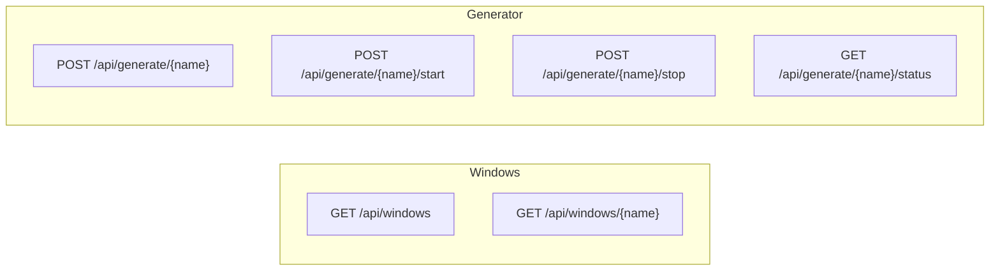

# REST API Reference

## Base URL

```
http://localhost:8080/api
```

## Endpoints

### List All Windows

```http
GET /api/windows
```

Returns all configured window schemas.

**Response** `200 OK`

```json
[
    {
        "name": "Orders",
        "primaryKeys": ["orderId"],
        "columns": [
            { "name": "orderId", "type": "string" },
            { "name": "symbol", "type": "string" },
            { "name": "side", "type": "string" },
            { "name": "quantity", "type": "int" },
            { "name": "price", "type": "double" },
            { "name": "status", "type": "string" },
            { "name": "timestamp", "type": "long" }
        ]
    },
    {
        "name": "Quotes",
        "primaryKeys": ["symbol"],
        "columns": [
            { "name": "symbol", "type": "string" },
            { "name": "bid", "type": "double" },
            { "name": "ask", "type": "double" },
            { "name": "bidSize", "type": "int" },
            { "name": "askSize", "type": "int" },
            { "name": "exchange", "type": "string" },
            { "name": "timestamp", "type": "long" }
        ]
    }
]
```

---

### Get Window Schema

```http
GET /api/windows/{name}
```

| Parameter | Type | Description |
|-----------|------|-------------|
| `name` | path | Window name (case-sensitive) |

**Response** `200 OK` — WindowConfig JSON  
**Response** `404 Not Found` — if window name is unknown

---

### Generate Batch Events

```http
POST /api/generate/{name}
Content-Type: application/json

{ "count": 50 }
```

| Parameter | Type | Description |
|-----------|------|-------------|
| `name` | path | Window name |
| `count` | body | Number of random events to generate (default: 10) |

**Response** `200 OK`

```json
{
    "generated": 50,
    "window": "Orders"
}
```

**Response** `400 Bad Request` — if window name is unknown

```json
{
    "error": "Unknown window: InvalidName"
}
```

---

### Start Continuous Generation

```http
POST /api/generate/{name}/start
Content-Type: application/json

{ "ratePerSecond": 10 }
```

| Parameter | Type | Description |
|-----------|------|-------------|
| `name` | path | Window name |
| `ratePerSecond` | body | Events per second (default: 5) |

Starts a background scheduled task that generates one random event per period. If continuous generation is already running for this window, it is stopped and restarted with the new rate.

**Response** `200 OK`

```json
{
    "status": "started",
    "ratePerSecond": 10,
    "window": "Orders"
}
```

---

### Stop Continuous Generation

```http
POST /api/generate/{name}/stop
```

| Parameter | Type | Description |
|-----------|------|-------------|
| `name` | path | Window name |

**Response** `200 OK`

```json
{
    "status": "stopped",
    "window": "Orders"
}
```

---

### Get Generation Status

```http
GET /api/generate/{name}/status
```

| Parameter | Type | Description |
|-----------|------|-------------|
| `name` | path | Window name |

**Response** `200 OK`

```json
{
    "running": true,
    "window": "Orders"
}
```

---

## Endpoint Summary



## Error Handling

All error responses use a simple JSON format:

```json
{
    "error": "Human-readable error message"
}
```

| HTTP Status | Condition |
|-------------|-----------|
| `200` | Successful operation |
| `400` | Invalid window name or bad request body |
| `404` | Window not found (GET /api/windows/{name} only) |
