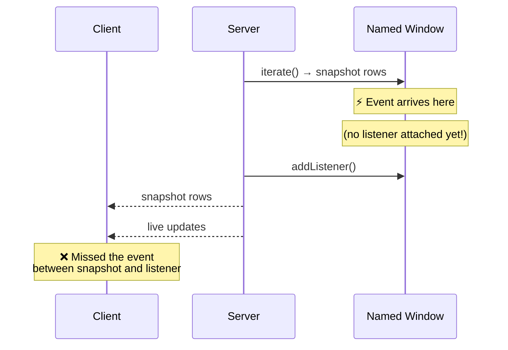
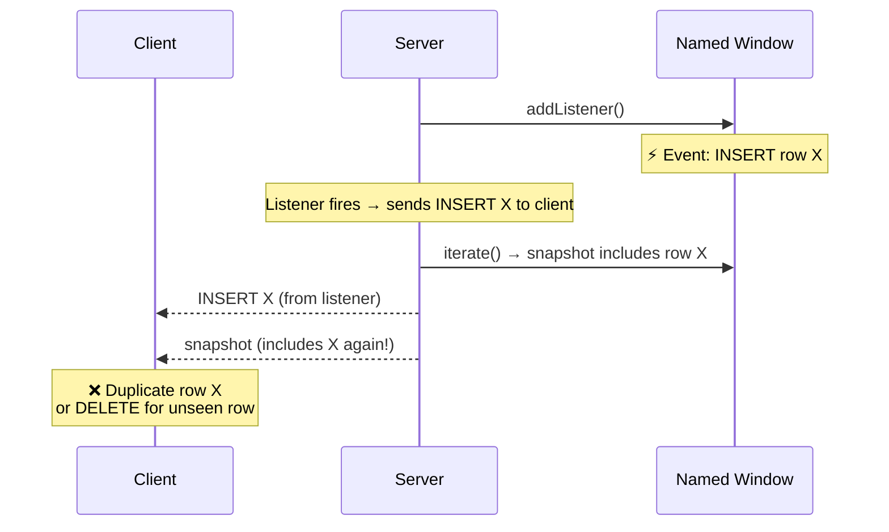
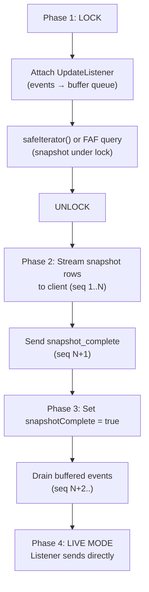
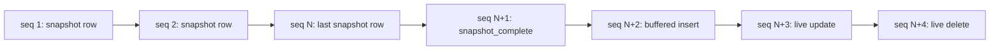
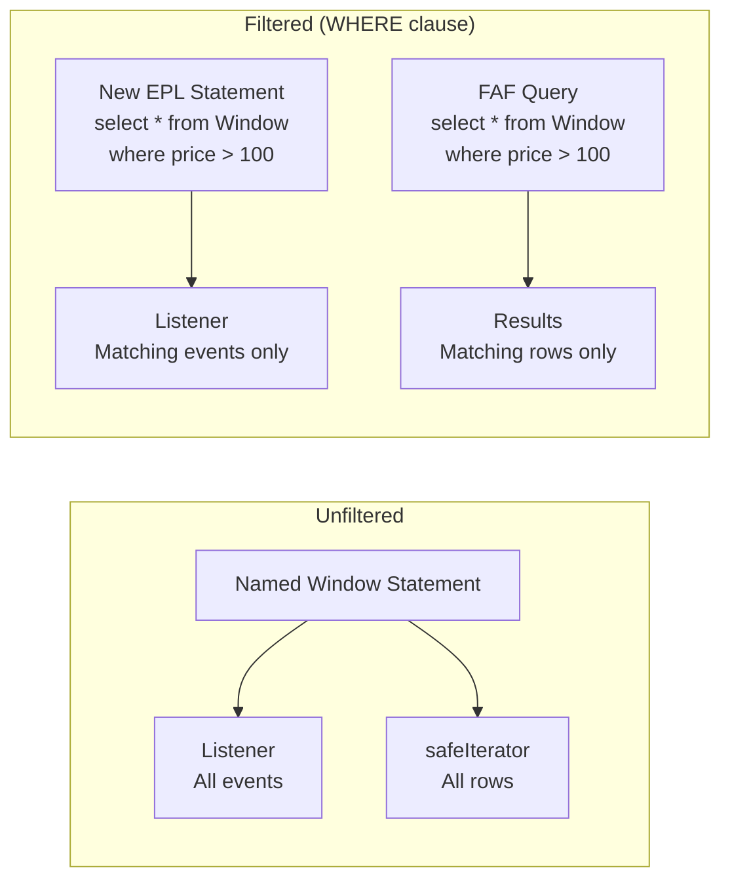

# Snapshot-Streaming Design

## The Problem

When a client subscribes to a named window, it needs **two things**:

1. **The current state** (all rows matching the filter) — the *snapshot*
2. **Ongoing changes** (inserts, updates, deletes) — the *live stream*

Naively combining these is fraught with race conditions:

### Approach A: Snapshot First, Then Listener



**Result:** Events that arrive between the snapshot read and listener attachment are **lost forever**.

### Approach B: Listener First, Then Snapshot



**Result:** The client may see **duplicates** (insert from listener + same row in snapshot) or receive a **delete for a row it hasn't seen yet** (if a delete fires before the snapshot reaches the client).

## The Solution: Lock → Listener → Snapshot → Unlock → Stream → Drain

The `SubscriptionManager` implements a carefully ordered protocol that guarantees **no missed events** and **correct ordering**:



### Detailed Step-by-Step

#### Phase 1 — Atomic Setup (Under Lock)

```java
ReentrantLock lock = esperService.getWindowLock(windowName);
lock.lock();
try {
    // 1. Attach listener — events buffer into a BlockingQueue
    listenerStmt.addListener(listener);
    
    // 2. Snapshot the window (still under lock)
    Iterator<EventBean> iterator = windowStmt.safeIterator();
    // ... collect rows ...
    
    // For filtered subscriptions: execute FAF query under lock
    if (whereClause != null) {
        snapshotRows = esperService.executeQuery(windowName, whereClause);
    }
} finally {
    lock.unlock();
}
```

**Why this works:** While the lock is held, no events can be committed to the window (the event-sending thread must acquire the same lock — see caveat in [Issues](./Issues.md)). The listener is attached *before* the snapshot is taken, so:

- Any event that arrives **before** the lock is acquired is in the snapshot.
- Any event that arrives **after** the lock is released is captured by the listener → goes into the buffer.
- No event is missed.

#### Phase 2 — Stream Snapshot

```java
for (Map<String, Object> row : snapshotRows) {
    DataMessage msg = new DataMessage(
        seqCounter.incrementAndGet(), "snapshot", windowName, subscriptionId, row);
    messagingTemplate.convertAndSendToUser(sessionId, destination, msg);
}

// Marker
DataMessage completeMsg = new DataMessage(
    seqCounter.incrementAndGet(), "snapshot_complete", windowName, subscriptionId, null);
messagingTemplate.convertAndSendToUser(sessionId, destination, completeMsg);
```

Each snapshot row is tagged `type: "snapshot"` with a monotonically increasing sequence number.

#### Phase 3 — Drain Buffer

While the snapshot was being streamed, the listener may have accumulated events in the `BlockingQueue`. After setting `snapshotComplete = true`, the buffer is drained:

```java
subscription.snapshotComplete = true;

List<DataMessage> buffered = new ArrayList<>();
buffer.drainTo(buffered);
for (DataMessage msg : buffered) {
    messagingTemplate.convertAndSendToUser(sessionId, destination, msg);
}
```

#### Phase 4 — Live Mode

With `snapshotComplete = true`, the `sendOrBuffer()` method switches from buffering to direct send:

```java
private void sendOrBuffer(...) {
    if (subscription.snapshotComplete) {
        messagingTemplate.convertAndSendToUser(sessionId, destination, msg);
    } else {
        buffer.offer(msg);
    }
}
```

## Sequence Number Guarantees

Every `DataMessage` carries a `seq` field from an `AtomicLong` counter scoped to the subscription:



The client can use sequence numbers to:
- Detect gaps (though the current client does not implement retransmission)
- Know the total ordering of all messages within a subscription
- Distinguish snapshot data from live updates

## Filtered Subscriptions

When the client provides a WHERE clause (e.g., `price > 100`):

1. **Listener:** A new EPL statement `select * from <Window> where <clause>` is compiled and deployed. The listener is attached to this filtered statement, so only matching events trigger callbacks.
2. **Snapshot:** A fire-and-forget query `select * from <Window> where <clause>` is executed under the lock to get only matching rows.



## Client-Side Handling

The browser client processes messages in order:

| Message Type | AG-Grid Action |
|-------------|----------------|
| `snapshot` | `applyTransaction({ add: [row] })` |
| `snapshot_complete` | Set status to "Live" |
| `insert` | `applyTransaction({ add: [row] })` with green flash |
| `update` | `applyTransaction({ update: [row] })` with yellow flash |
| `delete` | `applyTransaction({ remove: [row] })` with red flash |

The `getRowId` function uses the primary key(s) joined by `|` to match rows for update and delete operations.

## Why This Design Matters

This pattern is essential for **financial trading applications** and similar domains where:

- **Data completeness** — missing a single order update could show stale state
- **Ordering** — seeing a delete before the insert would cause errors  
- **Consistency** — the snapshot must represent a valid point-in-time view
- **No downtime** — the system continues accepting events during subscription setup

Without the lock-buffer-snapshot protocol, clients would experience silent data corruption, ghost rows, or missing entries — all unacceptable in a real-time data grid.
