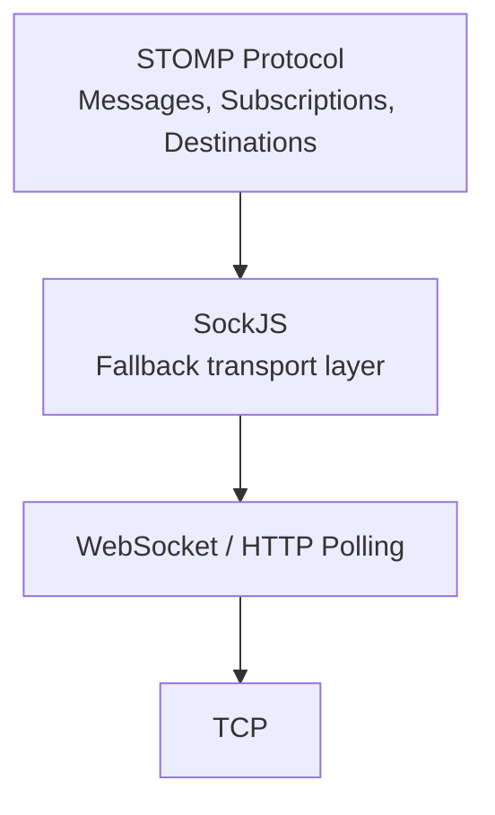
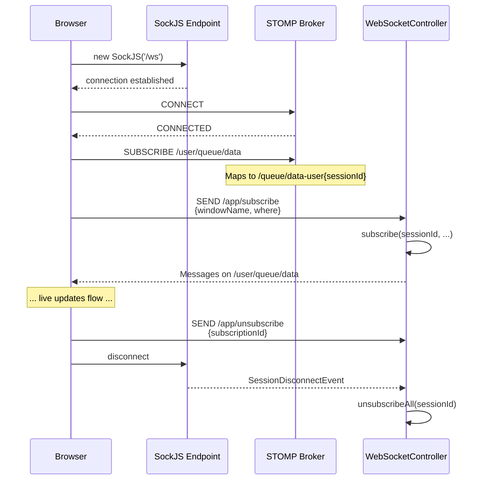
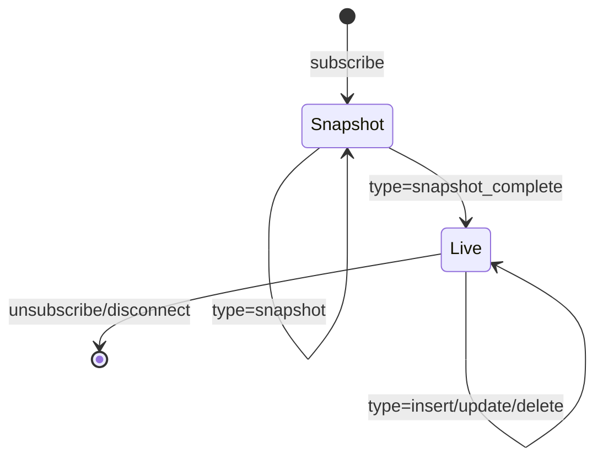
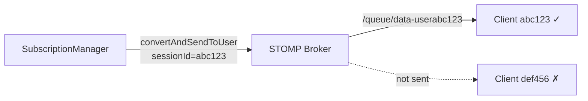

# WebSocket & STOMP Protocol

## Transport Stack



The application uses **STOMP** (Simple Text Oriented Messaging Protocol) over **SockJS** for client-server real-time communication. SockJS provides automatic fallback to HTTP long-polling when WebSocket is unavailable.

## Configuration

`WebSocketConfig.java` sets up:

| Setting | Value | Purpose |
|---------|-------|---------|
| Simple Broker | `/topic`, `/queue` | In-memory message broker destinations |
| Application prefix | `/app` | Client-to-server message routing prefix |
| User prefix | `/user` | Per-session user destination prefix |
| Endpoint | `/ws` | SockJS endpoint with `*` CORS |

## Connection Lifecycle



## STOMP Destinations

### Client → Server (Application Messages)

| Destination | Payload | Description |
|-------------|---------|-------------|
| `/app/subscribe` | `{ "windowName": "Orders", "where": "price > 100" }` | Subscribe to a named window with optional filter |
| `/app/unsubscribe` | `{ "subscriptionId": "uuid" }` | Cancel a subscription |

### Server → Client (User Queue)

| Destination | Message Type | Description |
|-------------|-------------|-------------|
| `/user/queue/data` | `snapshot` | A single row from the initial window snapshot |
| `/user/queue/data` | `snapshot_complete` | Marker indicating snapshot delivery is finished |
| `/user/queue/data` | `insert` | A new row was inserted into the window |
| `/user/queue/data` | `update` | An existing row was modified |
| `/user/queue/data` | `delete` | A row was removed from the window |
| `/user/queue/data` | `error` | Subscription error (e.g., window not found) |

## Message Format — `DataMessage`

All server → client messages use a uniform JSON envelope:

```json
{
    "seq": 42,
    "type": "insert",
    "windowName": "Orders",
    "subscriptionId": "a1b2c3d4-...",
    "data": {
        "orderId": "O-12345",
        "symbol": "AAPL",
        "side": "BUY",
        "quantity": 500,
        "price": 178.50,
        "status": "NEW",
        "timestamp": 1775000000000
    }
}
```

### Field Reference

| Field | Type | Description |
|-------|------|-------------|
| `seq` | `long` | Monotonically increasing sequence number, per subscription |
| `type` | `string` | One of: `snapshot`, `snapshot_complete`, `insert`, `update`, `delete`, `error` |
| `windowName` | `string` | The name of the source window (e.g., `"Orders"`) |
| `subscriptionId` | `string` | UUID identifying this subscription |
| `data` | `object\|null` | Row data as key-value pairs. `null` for `snapshot_complete`. For `error`, contains `{ "error": "message" }` |

### Message Type Semantics



## Session Management

### Disconnect Handling

When a WebSocket session disconnects (network failure, tab close, etc.), Spring fires a `SessionDisconnectEvent`. The `WebSocketController` listens for this and calls `subscriptionManager.unsubscribeAll(sessionId)`, which:

1. Finds all `Subscription` objects with the matching session ID
2. Sets `active = false` on each
3. Removes the update listener from the Esper statement
4. Undeploys any owned filtered statements
5. Removes the subscription from the active subscriptions map

### Reconnection

The browser client implements automatic reconnection:

```javascript
stompClient.connect({}, onConnect, function(error) {
    // Reconnect after 3 seconds
    setTimeout(connectWebSocket, 3000);
});
```

Note: Reconnection re-establishes the WebSocket but does **not** automatically re-subscribe to windows. The user must click Subscribe again.

## User Destination Routing

Spring's user destination system maps `/user/queue/data` to a session-specific queue. The server uses `SimpMessagingTemplate.convertAndSendToUser(sessionId, "/queue/data", msg)` which internally resolves to `/queue/data-user{sessionId}`, ensuring messages are delivered only to the intended client.


